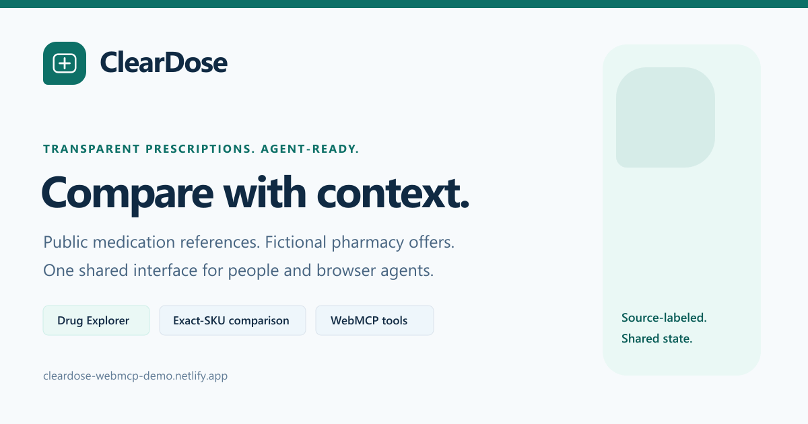

# ClearDose

> Transparent prescriptions. Agent-ready.

## Overview

ClearDose combines public medication reference data with a fictional prescription purchasing workflow for the WebMCP Challenge. A person can search generic or brand names, inspect source-labeled records, and compare related catalog records. Public medications and the original fixtures support exact demo configurations, fictional pharmacy offers, a multi-item cart, savings review, and simulated checkout.

Production: [cleardose-webmcp-demo.netlify.app](https://cleardose-webmcp-demo.netlify.app)

Project pages: [WebMCP tools and examples](https://cleardose-webmcp-demo.netlify.app/webmcp) · [Hackathon overview](https://cleardose-webmcp-demo.netlify.app/hackathon) · [Public repository](https://github.com/bclonan/simple-dose)



The repository URL is public. Publishing this working-tree release to that repository remains a separate step, tracked by `projectReadiness.sourceReleasePublished` in `src/content/project.ts`. The public YouTube demo is still pending. `projectLinks.youtubeUrl` is intentionally empty, and the hackathon page displays `[YOUTUBE_URL]` as a placeholder rather than a completed submission item.

An agent follows the same application services through twelve static browser tools, two dynamic medication tools, and five Drug Explorer tools. Public drug requests go through `cleardose-data-plugin`; workflow state and caches remain browser-local. There is no application backend, account system, payment processor, or app-side model API. The connected browser agent supplies the LLM and reads current catalog choices through compact WebMCP schemas and paged results.

## Challenge concept

ClearDose tests whether a browser agent can help with a detailed shopping flow without scraping button labels or maintaining a hidden copy of application state. Medication configuration makes that constraint concrete. A comparison is only valid when the active ingredient, form, strength, and quantity match.

The demo keeps that exact selection visible while the human or agent searches, compares, chooses fulfillment, prepares a request card, and checks out. A seeded market update changes several prices so the same comparison can be run again against new state. Public medication comparisons are a separate reference workflow. Shared ingredients, classes, categories, or forms do not establish that medicines are interchangeable.

## Why WebMCP matters here

Screen-driving is a poor fit for exact prescription comparisons. WebMCP gives the browser agent named tools, JSON input schemas, and read or write annotations. The agent can ask for one exact SKU instead of inferring state from pixels.

Agent search updates the medication results. Agent selection changes the selected offer. Cart and delivery tools update the visible totals. Checkout creates a local order and opens its route. Read-only medication tools return normalized source data without changing routes or choosing a treatment. The floating WebMCP control expands into recent journeys and individual calls. Each call records timing, bounded input and output, and redacted before and after state. A reviewed journey can be replayed in order, except checkout and unsafe or incomplete histories. Context-sensitive read calls require additional mode and membership checks before replay.

WebMCP is optional. ClearDose remains usable when `document.modelContext` is unavailable, and the Agent Lab says so plainly.

WebMCP fits this flow because each useful agent action has a specific application action or read operation. It supports catalog discovery, reference comparison, exact fulfillment, cart correction, and checkout preparation. It is not a backend job or medical decision system. [The tool strategy](docs/WEBMCP_STRATEGY.md) maps the implementation to Chrome's [build guide](https://developer.chrome.com/docs/ai/webmcp/build-tools), [best practices](https://developer.chrome.com/docs/ai/webmcp/best-practices), [eval guidance](https://developer.chrome.com/docs/ai/webmcp/evals), [security guidance](https://developer.chrome.com/docs/ai/webmcp/secure-tools), and [use cases](https://developer.chrome.com/docs/ai/webmcp/use-cases).

## Architecture

```text
RxNorm / openFDA / NADAC       Demo cash fixture
             │                       │
             └──────────┬────────────┘
                        ▼
              cleardose-data-plugin
              normalized data + cache
                        │
                        ▼
              MedicationRepository
                        │
                        ▼
            shared Pinia state + actions
                        │
                  ┌─────┴─────┐
                  ▼           ▼
                Vue UI      WebMCP

Exact demo SKUs/offers retain their IDs through the repository.
Public benchmark quotes never become cart offers.
```

`src/plugins/cleardose.ts` creates one plugin instance. `src/services/medication.repository.ts` adapts its normalized records to stable application IDs and existing component shapes. Components, stores, and WebMCP handlers do not construct provider URLs or make their own FDA, RxNorm, or NADAC requests. The app does not invoke the plugin's separate WebMCP registrar.

Pure catalog and pricing functions retain exact SKU lookup, scenario overrides, subtotal math, delivery totals, and ranking. Pinia holds search and loading state, normalized public records, selections, cart, orders, and activity. [The migration map](docs/data-migration.md) records the preserved compatibility boundaries.

## Public data, modes, and fallback

The catalog page has a data-mode selector. Production defaults to `hybrid`; deterministic tests can select `demo`.

| Mode | Medication information | Commerce |
| --- | --- | --- |
| `hybrid` | Public queries, cached records, and labeled local fallback | Generated public-drug demo offers and original fictional fixtures |
| `live` | Public records where available, including cached public data | The same clearly labeled mock cart, separate from public facts |
| `demo` | Original deterministic catalog; no public detail fetch | Original fictional workflow |

RxNorm identity lookup, openFDA product and label data, and NADAC benchmarks are enabled. On startup, hybrid and live modes run 24 medication-name searches with three workers and at most four hits per query. Cached names appear immediately; partial failures do not block browsing or the cart. More names can be loaded through search. Details and comparisons request clinical sections and benchmarks on demand. This does not preload the entire FDA database.

The store retains up to 100 active public identities alongside the 12 original seed records. Explorer selections remain in that active limit. A separate archive preserves identities referenced by saved carts, orders, or requests. Existing IDs remain intact. New `med-public-*` records receive stable pseudo-random demo offers from `src/domain/demo-public-fulfillment.ts`. Their saved configuration and prices survive enrichment and reload. Generated form/strength pairings, quantities, inventory and prices are explicitly fictional. Missing clinical fields and prescription status stay unknown. Categories use supported catalog mappings or source classes, with Other medications as the fallback.

NADAC queries cover up to 100 exact package NDCs per drug in four batches of 25, with at most two requests running at once under an overall deadline. They keep the latest available row for each checked NDC. Coverage can be partial. A benchmark is a pharmacy acquisition-cost reference, not retail cash pricing, patient copay, or pharmacy inventory. The quote's NDC and quantity remain visible and do not automatically match the selected demo SKU. The reusable plugin supports a local Medicare index, but this app keeps it disabled because no genuine preprocessed index is configured. The bundled example is not production Medicare data.

Public source records use the plugin's IndexedDB cache, with a memory fallback when persistent storage fails. Default freshness is one day for search and product records, 30 days for RxNorm identity, and seven days for label and NADAC records. Expired records can be returned with an explicit stale-cache warning if their provider fails. Concurrent identical requests are deduplicated. Optional source failures return partial normalized records and provider notices rather than blanking the detail page.

Source stamps retain provider, retrieval time, available effective dates, and dataset version. Search, details, and comparison distinguish public data, cached data, stale cache, demo fallback, and unavailable fields. Missing clinical text is not a clean safety result.

## Shared human and agent state

`src/services/cleardose.actions.ts` is the shared workflow action layer. Vue views and components call it for search, fulfillment comparison, selection, prescription requests, cart changes, delivery changes, and checkout. `src/webmcp/definitions.ts` validates tool input and calls those same actions. Public detail and related-record UI components share `catalog.loadMedication`, `catalog.findRelated`, and `catalog.compareMedications` with the dynamic tool callbacks in `src/webmcp/medication-context.ts`.

For example, the visible "Add selected option to cart" button and the `add_to_cart` tool both reach `actions.addToCart`, which calls `cart.addItem`. WebMCP is an adapter around the application. It is not a parallel API.

## Critical user journey

```text
Search medication
    ↓
Choose exact strength/form/quantity
    ↓
Compare exact prescription across pharmacies
    ↓
Compare medication + fulfillment + delivery total
    ↓
Select best option
    ↓
Generate prescription request card
    ↓
Add medication to cart
    ↓
Add another exact medication when needed
    ↓
Compare current cart savings
    ↓
Choose delivery
    ↓
Complete simulated checkout
    ↓
Track simulated order
```

The main routes are `/`, `/medications`, `/medications/:slug`, `/drugs/explore`, `/compare`, `/prescription-card`, `/checkout`, `/orders/:id`, `/webmcp`, and `/hackathon`.

Drug Explorer creates a side-by-side report for up to four medications. Topic rows retain per-fact availability, source dates, and expandable original text. Its neutral highlights describe different source details, not a medication ranking. Downloaded HTML keeps the complete loaded source text; printed reports use labeled excerpts. Download and print require a visible user action.

## WebMCP tools

ClearDose retains twelve static workflow tools and five Explorer tools with stable declarations. Two additional context-sensitive medication tools register when the active catalog has medication choices. A populated hybrid catalog therefore exposes nineteen tools through `document.modelContext.registerTool`.

| Tool | Effect profile | What it does |
| --- | --- | --- |
| `search_medications` | State change, idempotent | Searches the catalog, persists the search state, updates the visible results, and opens `/medications`. |
| `get_medication_details` | Read only, idempotent | Loads shared public details and pages through exact mock-shop configurations. Returns source names, available clinical sections, and data status. Generated demo configurations are separate from public facts; prescription status stays unknown when the source does not establish it. |
| `compare_fulfillment_options` | State change, idempotent | Compares one exact SKU or reuses the current exact selection, persists the comparison, and opens `/compare`. |
| `select_medication_option` | State change, idempotent | Saves one exact offer and delivery option in the shared selection state. |
| `create_prescription_request_card` | State change | Creates and displays a local request summary. It does not issue or transmit a prescription. |
| `add_to_cart` | State change | Adds one exact offer and delivery choice to the visible demo cart. |
| `view_cart` | Read only, idempotent | Returns paged cart lines, delivery alternatives, totals, checkout readiness, and required checkout fields. It opens the cart drawer but does not change stored commerce data. |
| `compare_cart_savings` | Read only, idempotent | Compares every cart line with the lowest current delivered total for the same exact SKU. It returns safe same-offer or replacement steps without changing the cart. |
| `remove_cart_item` | State change, destructive, idempotent | Removes one item by a current `cartItemId`, opens the cart, and returns the revised totals. |
| `set_delivery_option` | State change, idempotent | Changes one cart item's delivery option and recalculates totals. |
| `checkout_demo_order` | State change, destructive | Creates a simulated local order, consumes the cart, and uses demo address fields. |
| `get_order_status` | Read only, idempotent | Returns a sanitized, paged status for an explicit order or the current local order. |
| `find_related_medications` | Read only, dynamic | Matches one current medication against page or loaded-catalog candidates by ingredient, class, category, or form, with an explicit reason for each match. |
| `compare_medications` | Read only, dynamic | Reads full normalized sections for one medication or compares up to four current IDs, with paginated field rows. |
| `cleardose_select_drugs` | State change | Replaces, adds, or removes up to four drugs from the visible Explorer selection. Does not change the cart or prescriptions. |
| `cleardose_show_drug_fact` | State change | Adds or replaces selected report topics, optionally replacing the medication selection in the same revision-checked edit. |
| `cleardose_update_fact_card` | State change, idempotent | Changes one existing report row to a supported fact type while keeping the shared medication selection. |
| `cleardose_remove_fact_card` | State change, idempotent | Removes one current report row. Selected drugs and public medication records remain unchanged. |
| `cleardose_get_explorer_state` | Read only, idempotent | Pages through selected drugs, fact rows and availability, or current catalog IDs. Continuation pages require both returned revision tokens. |

Chrome's current Imperative API receives `readOnlyHint` and `untrustedContentHint`. Public-data tools and commerce outputs containing source-derived medication labels mark that content as untrusted. The Agent Lab also records local effect metadata for destructive and idempotent behavior. Consequential effects stay explicit in descriptions and the interface. `remove_cart_item` deletes one cart line. `checkout_demo_order` creates a local order and consumes the cart.

The twelve static registrations share one abort-owned lifetime. Each dynamic registration has its own controller and declaration signature. Only changed tools are replaced, and an executing tool keeps its registration until it returns. Unchanged refreshes do not rediscover the registry. A route-only change keeps handles when the available medication IDs and page scope are unchanged; results still report the current route. Stale contexts fail with instructions to refresh tools.

Small catalogs use compact ID enums. Larger catalogs use bounded IDs and direct the agent to `cleardose_get_explorer_state` with `section: "catalog"` for paged ID/name context. Runtime membership and revision checks still apply. ClearDose enforces its own tested 18,000-byte aggregate declaration budget, not a claimed browser limit. Public label paragraphs stay in results, never in schema instructions. Explorer declarations remain stable across workspace edits. Each mutation reads current state and validates the supplied revision and IDs at execution time.

ClearDose does not pass `exposedTo`, so it does not opt any tool into cross-origin exposure. When `getTools` exists, the app verifies expected names and refreshes the count after `toolchange`. A partial registry is `degraded` and lists missing names. An available tool can still run natively; a missing tool-card example uses the shared local definition. If registration succeeds without discovery, the status is `ready-unverified`, and the count is configured rather than verified.

`find_related_medications` is a deterministic catalog match, not a model-generated recommendation. Ingredient and pharmacologic-class matches use public facts already loaded for both records. Category and form matches use explicit catalog metadata. It does not fetch every record, infer treatment equivalence, or search the entire FDA database for substitutes. Use `search_medications` to load candidates and `compare_medications` to inspect their public data. The connected agent can use this context for more informed search; ClearDose itself does not run an LLM.

Schemas reject undeclared fields with `additionalProperties: false` and use required fields, enums, patterns, and numeric limits. Runtime parsers repeat those checks, including exact IDs, real calendar dates, state codes, postal codes, and the rule that a comparison receives all four exact SKU fields or none. Errors name the next tool to call when recovery is possible.

Agent Lab manual execution serializes input to JSON text before calling `document.modelContext.executeTool(tool, jsonInput)`, then parses textual JSON results. Only a read-only call may retry an older object-input convention after an explicit format rejection. A mutation is never repeated under a different convention after an uncertain response.

The contracts follow Chrome's character budgets: 500 for a tool description, 150 for a parameter description, 30 for tool and parameter names, and 1,500 for serialized output. `create_prescription_request_card` keeps its longer original challenge name as a compatibility exception. Workflow tools use bounded pages with continuation offsets. Dynamic medication tools return JSON Pointer field rows; long strings have ordered `part` and `parts` values. Follow `nextOffset` to read the full selected section. `identity`, `product`, `clinical`, `prices`, and `sources` remain separate, and clinical paging preserves long label sections. Starting at offset zero refreshes the result; continuation pages use its saved result snapshot.

Order results omit recipient names and addresses. Logs retain bounded context and redact personal fields. Dynamic read receipts preserve their complete bounded field-row page, continuation metadata, and notice. Recorded catalog and cart ID lists support up to 112 IDs.

Replay requires visible review and confirmation. It checks every recorded step's before and after data mode before running, then checks the mode again at each step. For the two dynamic medication tools, it validates saved IDs against the current catalog and requested page scope before binding the current context revision. Explorer mutation replay binds the current workspace revision after checking the recorded context and any required selection. A saved card ID rebinds only to a current card with the same fact and medication IDs. Read-state replay also updates a saved workspace revision but keeps its saved `stateRevision`, so changed catalog or workspace pages must restart. Other arguments remain unchanged, except optional redacted fields are removed. Normal runtime stale-context checks still apply. Checkout identity and address fields are never replayed.

## Local demo database

The fallback and exact-commerce fixture remains in `src/data/cleardose-demo-db.json`. It is not the primary public drug-data source. Its JSON Schema is `src/data/cleardose-demo-db.schema.json`, and its compatibility types are in `src/types/demo-db.ts`.

The current seed has:

- 12 seeded medication records
- 4 fictional pharmacies
- 78 exact medication SKUs
- 312 pharmacy offers
- 1 market update pricing scenario

The top-level records are `metadata`, `medications`, `pharmacies`, `skus`, `offers`, and `pricingScenarios`. Offers store medication cost, fulfillment fee, markup, and available delivery methods. The pricing code recomputes scenario subtotals from their components and calculates delivered total by adding the selected delivery price.

Search state, selection, scenario, the latest prescription request, multi-item cart, orders, and bounded tool journeys persist in `localStorage`. Public identity mappings and the selected data mode use separate local keys; source records use IndexedDB. "Reset demo" clears the workflow state and log. It does not erase the public-source cache or change the selected data mode. If browser storage is blocked or full, the in-memory application still works for the current session.

## Run locally

Use Node.js 20.19 or newer and pnpm 11.8.

```bash
pnpm install --frozen-lockfile
pnpm dev
```

Open the local URL printed by Vite.

Public browser providers need no API key. `.env.example` documents the optional deterministic data-mode setting. No client-side LLM key is required because the connected browser agent supplies the model. Never put a secret in a `VITE_` variable; Vite exposes those values to the browser. Optional server-side environment examples are not required for this static application.

To run the production build locally:

```bash
pnpm build
pnpm preview
```

## Test and build

```bash
pnpm typecheck
pnpm test
pnpm test:evals
pnpm exec playwright install chromium
pnpm test:e2e
pnpm build
```

`pnpm test` runs domain, provider, repository, and WebMCP registration tests. `pnpm test:evals` runs deterministic call-contract, multi-cart, savings-swap, replay-security, ordering, and recovery coverage. These checks do not score a live language model. Chromium tests cover purchase/replay flows, mocked official providers, public-drug shopping in live/hybrid modes, cache recovery, clinical comparison, long native-registration sequences, and card layout at four widths. `pnpm build` runs the TypeScript check before Vite creates `dist`.

Run the full local gate after Chromium is installed:

```bash
pnpm verify
```

To run only the WebMCP registration suite:

```bash
pnpm exec vitest run src/webmcp/register.test.ts
```

## Enable and test WebMCP

ClearDose does not hide WebMCP behind an application setting. Native registration becomes available when the browser exposes the current imperative `document.modelContext.registerTool` API.

1. Start ClearDose and open `/webmcp` in a WebMCP-compatible browser or agent environment.
2. Check the Agent Lab status. `ready` means the page read the real registry with `document.modelContext.getTools` and found all currently expected tools, usually nineteen in hybrid mode. `degraded` lists missing tools. `ready-unverified` means registration completed without browser discovery.
3. Run an example from a tool card or send one of the prompts below through the connected agent.
4. Watch the same search, comparison, selection, prescription, cart, and order state update in the interface.
5. Expand the floating WebMCP control. Inspect a journey's calls, redacted context, timing, and before and after state.
6. Review and confirm a safe journey replay. Checkout histories stay blocked.
7. In hybrid or demo mode, switch to "Market update" and run the exact-SKU comparison again. For public reference data, search a medication, refresh the available tools, and use `compare_medications` sections and continuation offsets.

When WebMCP is unavailable, the rest of the pharmacy demo still works. Agent Lab examples and replay use the same action layer as a deterministic fallback, but they do not claim that native browser tools were registered. In `ready-unverified`, a tool-card example also uses that fallback because native discovery and execution cannot be confirmed.

## Add a useful tool

Start with a user goal the application already supports. Define the required state, one action or read operation, UI feedback, and recovery. Check for overlap first. Use shared actions or repository methods, narrow typed fields, runtime validation, bounded output, and honest effect annotations. Keep registration static unless availability or valid IDs depend on current context. Data-dependent schemas need stale-revision, refresh, cancellation, and duplicate-registration tests. Add direct, ambiguous, ordering, journey, and failure coverage where relevant. The full checklist is in [docs/WEBMCP_STRATEGY.md](docs/WEBMCP_STRATEGY.md).

### Keep the documentation synchronized

`/webmcp` builds its tool documentation from the canonical definitions through `src/webmcp/documentation.ts`. It is not a second tool registry. Tool definitions live in `src/webmcp/definitions.ts`, `src/webmcp/explorer.ts`, and `src/webmcp/dynamic.ts`. Add or change the schema at its owning definition, retain runtime validation, then update any curated documentation examples. `src/content/webmcp-workflows.ts` holds feature-oriented prompts and chained workflows. Documentation tests check tool coverage and example arguments against the current schemas.

The contributor guide on `/hackathon` explains the shared action, repository, and provider boundaries. [The documentation-page decision](docs/decisions/2026-09-03-documentation-pages.md) records the scope. Contributions should preserve UI and WebMCP parity, source provenance, local saved state, and confirmation boundaries. Run the focused tests for the changed module and the full verification gate before proposing a release. Do not publish patient data, API secrets, or unreviewed generated artifacts.

### Demo recording

The narrated 2:50 recording plan is on `/hackathon` and in [docs/demo-video-script.md](docs/demo-video-script.md). It specifies screen actions, narration, tool calls, and expected visible results. Recording and publishing an actual public YouTube video with audio remain pending. Set the verified URL in `src/content/project.ts`; the page will replace the placeholder with the supported YouTube embed.

## Demo prompts

Find and compare:

```text
Find atorvastatin 20 mg tablets, quantity 90.
Compare all fulfillment options and tell me the
cheapest total arriving within five days.
```

Prepare a prescription request:

```text
Find atorvastatin 20 mg, quantity 90, choose the
lowest-cost option arriving within five days,
and prepare a prescription request card.
```

Prepare checkout:

```text
Add the selected medication to my cart,
use standard delivery, and show me what
is needed to complete demo checkout.
```

Recheck after a price change:

```text
Prices changed. Recompare my selected medication
and tell me whether my current fulfillment option
is still the cheapest delivered within five days.
```

Build a multi-item cart and compare savings:

```text
Add atorvastatin 20 mg and metformin 500 mg to my
demo cart, then compare each exact SKU with its
lowest current delivered total.
```

Inspect related public records:

```text
Search for atorvastatin and rosuvastatin. Read their
public product and clinical sections, including sources.
Show which loaded catalog attributes they share without
recommending a substitution. Keep benchmarks separate
from fictional pharmacy offers.
```

For a short presentation, open the Agent Lab and inspect its current tool count. Show a dynamic ID schema changing after public search, then read a medication section. Switch to deterministic demo mode for the two-item savings journey. Expand the floating control, inspect its calls, and replay the reviewed workflow. Checkout histories remain blocked.

## Netlify deployment

`netlify.toml` runs `pnpm build`, publishes `dist`, and rewrites all routes to `/index.html` so direct visits to Vue Router paths work.

Install and authenticate the Netlify CLI if needed:

```bash
npm install -g netlify-cli
netlify login
```

Link the existing site once, create a preview from the tested build, and smoke-test it before publishing:

```bash
netlify link --id 1672a90c-47ec-43bb-b64a-ddb7e4ab2feb
pnpm build
netlify deploy --dir=dist --no-build
netlify deploy --prod --dir=dist --no-build
```

After deployment, open `/`, `/medications`, `/drugs/explore`, `/compare`, `/prescription-card`, `/checkout`, `/webmcp`, and `/hackathon`. Refresh a nested route directly to confirm the SPA rewrite. Check the native tool registry and verify that icons, `/og-image.png`, and `/LICENSE.txt` return their actual formats rather than the SPA HTML. The production site is [cleardose-webmcp-demo.netlify.app](https://cleardose-webmcp-demo.netlify.app).

## Metadata and brand assets

`index.html` supplies the default canonical, Open Graph, and Twitter/X metadata. `src/utils/page-metadata.ts` updates route titles and descriptions without putting selected medications, order IDs, or query values into sharing tags. Because this is a static SPA, crawlers that do not run JavaScript receive the default ClearDose sharing card on every route.

The favicon and social image reuse the prescription-card/plus mark from `src/components/AppHeader.vue` and the existing teal/navy palette. `public/favicon.ico` contains real 16, 32, and 48 pixel ICO entries. The Apple touch icon is 180 pixels square, the social image is 1200 by 630, and the manifest references 192 and 512 pixel PNGs. The manifest does not add offline support or a service worker.

Committed assets are ready to build without an image dependency. To regenerate them with an already-installed `sharp` module, run `node scripts/generate-brand-assets.mjs /absolute/path/to/sharp`. The SVG inputs stay in `public`; this optional generator does not change the application's dependency list. Focused metadata tests verify binary signatures, dimensions, icon links, route-tag behavior, and license parity.

## License

The project code and original project assets use the [MIT License](LICENSE). The site serves an identical copy at [`/LICENSE.txt`](public/LICENSE.txt). Third-party medication sources retain their own terms and attribution; this license does not relicense external data or turn the demo into a clinical service.

## Safety and disclaimer

Drug Explorer is available at `/drugs/explore`. Select up to four medications and add the facts you want to compare. The URL preserves the selection and cards, and five WebMCP workspace tools edit that same visible state. The [implementation report](docs/drug-explorer.md) lists the architecture, changed files, active sources, boundaries, and verification results.

ClearDose is a WebMCP technology demonstration with public medication reference data and fictional commerce. It does not provide medical advice, dispense medication, process prescriptions, or verify real pharmacy cash prices.

- No diagnosis or dosing recommendations
- No drug interaction recommendations
- No automated clinical substitution
- No insurance claims
- No real prescription issuance or transmission
- Use fictional patient and address fields only
- No real payment
- No claim of HIPAA compliance
- No claim that the seeded pharmacies are real
- Fulfillment savings never compare different medication SKUs

FDA interaction text is not a complete pairwise interaction engine. FAERS report counts do not establish causation or incidence. Missing warnings do not establish personal safety. NADAC is not a retail cash price, and Medicare gross spending is not patient out-of-pocket cost.

Use public records as source material and fictional information for demo forms. A prescription request card is a summary, not a prescription. Checkout creates a local simulated record and transmits no order, payment, or prescription.

## Future possibilities

A production version would need licensed data sources, authenticated users, consent controls, security review, audit records, and regulated integrations for pharmacies, prescribers, payments, and order status. Those changes should keep the current shared action rule so the human interface and browser tools cannot disagree about state or price calculations.

Clinical recommendations should remain outside this product unless a separate, validated medical system owns that responsibility.
